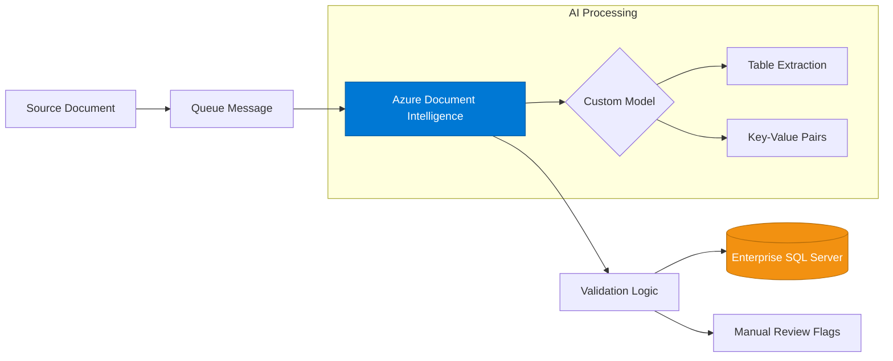

# Custom AI Models for Automated Data Entry with Azure Document Intelligence

**Bravado Solutions** | Specialized in building scalable AI systems, SaaS platforms, and automated cloud-native document pipelines.

Leverage Azure AI Document Intelligence to extract text, tables, and key data from complex forms and automatically update your enterprise database.

---

## 🚀 Overview
Manual data entry is the primary bottleneck for scaling administrative operations. This repository demonstrates an **Automated Data Extraction Pipeline** that transforms unstructured documents (PDFs, Images, Scans) into structured database records using specialized AI models.

## 🏢 The Challenge (Real-World Context)
Bravado Solutions recently partnered with a large organization struggling with thousands of purchase order (PO) documents. The manual entry process was:
* **Slow:** 5–10 minutes per document.
* **Error-Prone:** Frequent typos in SKU numbers and pricing.
* **Resource-Intensive:** Required a dedicated team just for data transcription.

## 💡 The Solution
We implemented a custom AI solution using **Azure AI Document Intelligence**. This system automatically extracts text, key-value pairs, and complex tables from forms, enabling accurate and scalable data entry across thousands of documents without human intervention.

---

## 🏗️ Architecture



## ⚙️ Key Features

* **Custom Neural Models:** Trained on industry-specific forms for 99%+ field accuracy.
* **Table Extraction:** Intelligent reconstruction of multi-page line items and nested tables.
* **Automated SQL Mapping:** Direct mapping of extracted JSON to relational database schemas.
* **Asynchronous Processing:** Built with a queue-based architecture to handle high-concurrency document uploads.
* **Confidence Scoring:** Automatic flagging of low-confidence extractions for manual review (Human-in-the-loop).

---

## 📋 1. Technical Pre-requisites

### A. Azure AI Document Intelligence Resource
* **Tier:** Must be **Standard (S0)**. The Free (F0) tier does not support "Neural" custom models.
* **Region:** Ensure your resource is in a region supporting Neural models (e.g., East US, West Europe).

### B. Labeled Training Data
The system requires labeled data to build a specialized model:
* **Blob Storage:** A container with 5–10 labeled sample documents.
* **Labels:** Use [Azure Document Intelligence Studio](https://documentintelligence.ai.azure.com/) to label fields.
* **SAS URL:** The `CONTAINER_SAS_URL` must point to this specific container.

### C. Infrastructure Requirements
* **Storage Queue:** Create a queue named `doc-processing-queue`.
* **CORS:** Enable CORS on your Storage Account for the Document Intelligence service.
* **SQL Server:** An Azure SQL Database or local instance with the following schema:

```sql
CREATE TABLE ExtractedDocuments (
    Id INT IDENTITY(1,1) PRIMARY KEY,
    DocumentType NVARCHAR(100),
    FieldName NVARCHAR(100),
    FieldValue NVARCHAR(MAX),
    Confidence FLOAT,
    ProcessedAt DATETIME DEFAULT GETDATE()
);
```
## 📂 Repository Structure

```text
bravado-serverless-ai/
├── .env.example            # Template for environment variables
├── .funcignore             # Files to exclude from Azure deployment
├── .gitignore              # Files to exclude from GitHub (secrets/cache)
├── Dockerfile              # Containerization configuration
├── function_app.py         # The Serverless Worker (Queue Trigger)
├── host.json               # Azure Function global config
├── orchestrator.py         # The Admin tool (Training & Feeding Queue)
├── README.md               # Documentation & Setup Guide
├── requirements.txt        # Python dependencies
└── src/
    ├── __init__.py         # Makes src a package
    ├── client_factory.py   # Azure Client Factory
    ├── database_manager.py # SQL Server Integration Logic
    ├── model_manager.py    # Training Logic
    └── processor.py        # AI Extraction Logic
```
## 🚀 Getting Started

1. **Clone the Repo**
2. **Install Dependencies:**
   ```bash
   pip install -r requirements.txt
3. **Configure Environment:** Rename `.env.example` to `.env` and fill in your Azure & SQL credentials.

4. **Train & Queue:** Run the orchestrator to build your custom model and begin processing:
   ```bash
   python orchestrator.py
5. **Run Worker:** Use the Azure Functions Core Tools to run the serverless extraction worker locally:
   ```bash
   func start
## 📚 Resources & Further Reading

### 🧠 Azure AI Document Intelligence
* **[Official Documentation](https://learn.microsoft.com/en-us/azure/ai-services/document-intelligence/)**: Comprehensive guides on OCR, Layout, and Custom Models.
* **[Document Intelligence Studio](https://documentintelligence.ai.azure.com/)**: The no-code graphical interface for labeling and testing models.

### ⚡ Serverless & Scaling
* **[Azure Functions Python Developer Guide](https://learn.microsoft.com/en-us/azure/azure-functions/functions-reference-python)**: Best practices for scaling Python workers.
* **[Azure Storage Queues SDK](https://learn.microsoft.com/en-us/azure/storage/queues/storage-python-how-to-use-queue-storage)**: Technical details on message polling and visibility.

### 🗄️ Database Integration
* **[Python SQL Driver (pyodbc)](https://github.com/mkleehammer/pyodbc/wiki)**: Documentation for connecting Python to SQL Server.
* **[ODBC Driver 18 for SQL Server](https://learn.microsoft.com/en-us/sql/connect/odbc/download-odbc-driver-for-sql-server)**: Installation links for the required database drivers.

---

## 🤝 Support & Consulting

**Bravado Solutions** specializes in architecting custom AI pipelines and cloud-native automation. If your organization needs help scaling document workflows or integrating LLMs into existing enterprise systems, reach out to our team.

* **Website:** [bravadosolutions.com](https://bravadosolutions.com)
* **Inquiries:** [contact@bravadosolutions.com](mailto:contact@bravadosolutions.com)
